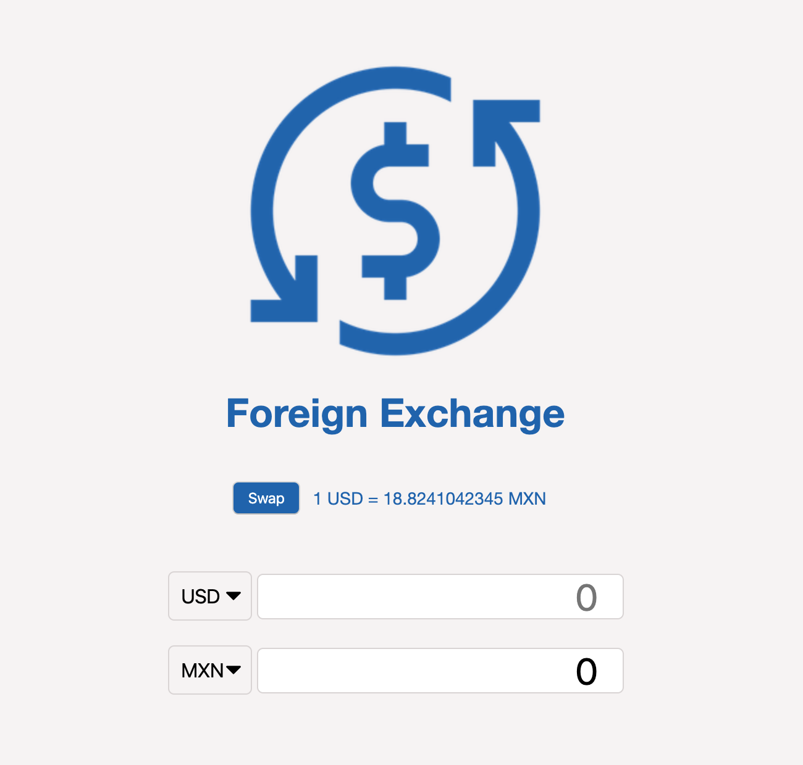
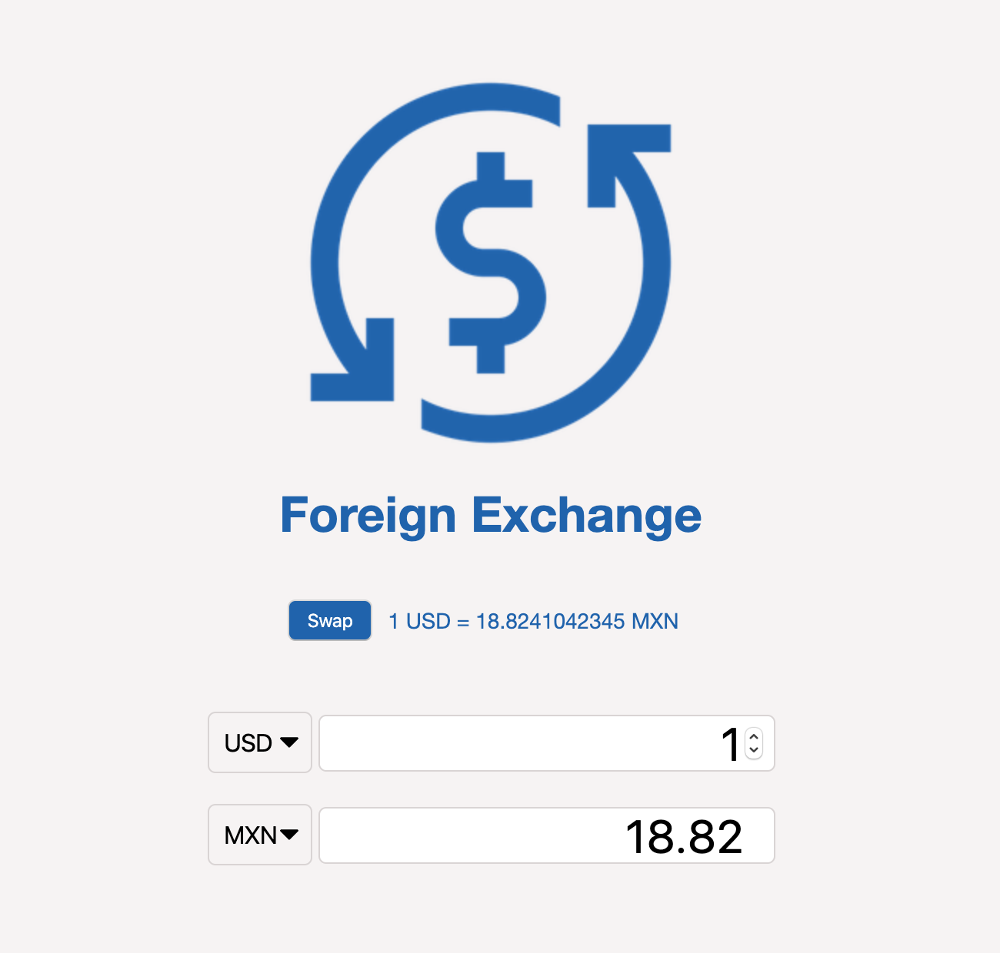
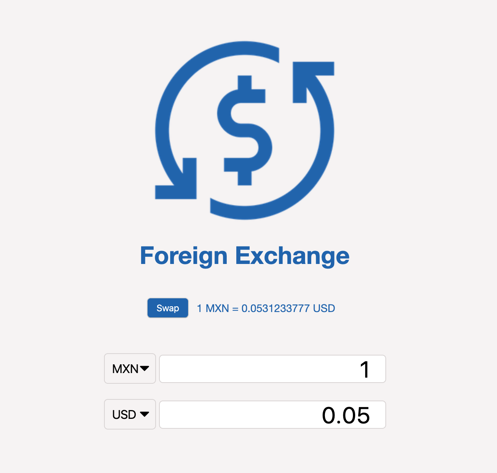

# App

Foreing currency calculator written with VanillaJS, HTML5 and CSS.
 
 
## Use
### Open index.html

### Select the currency and the desired amount to convert

### Easily swap between the current currencies

